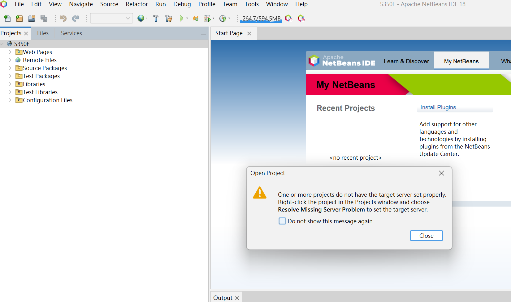
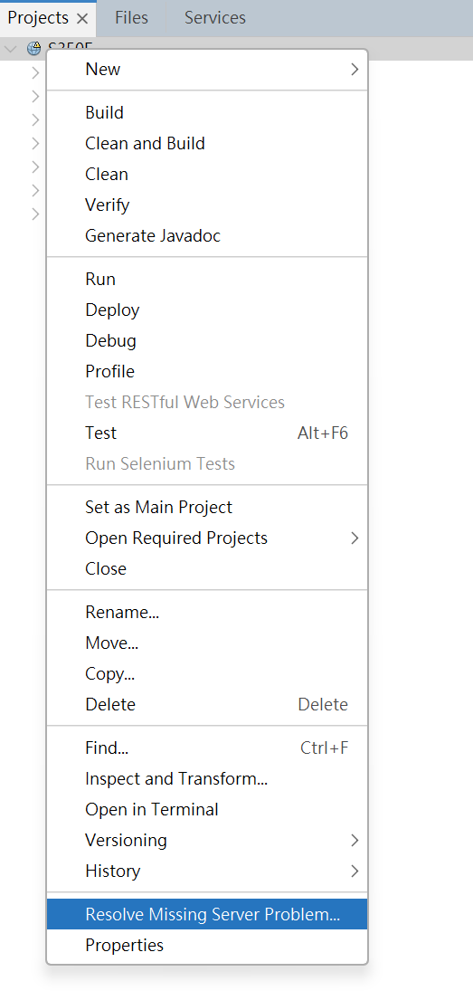
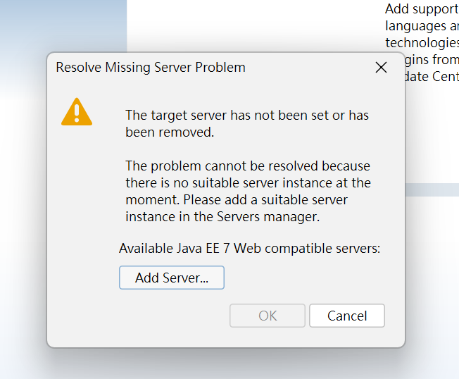
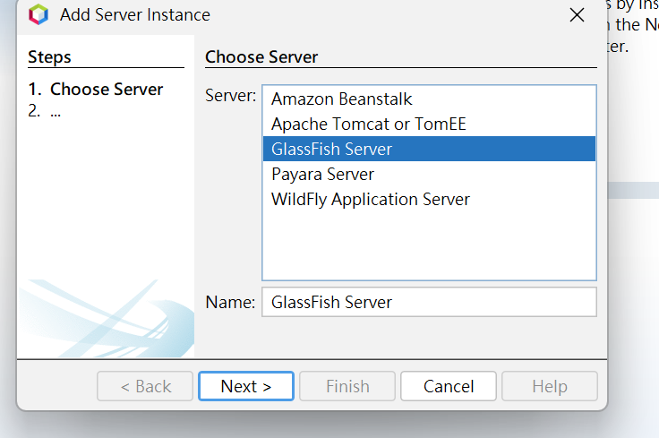
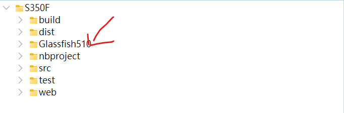
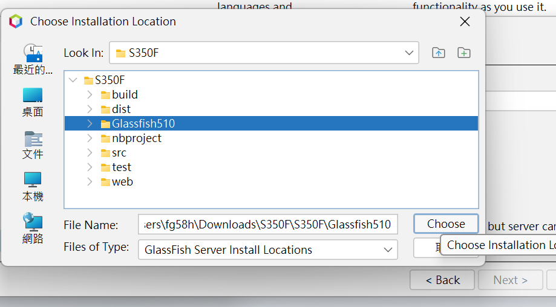
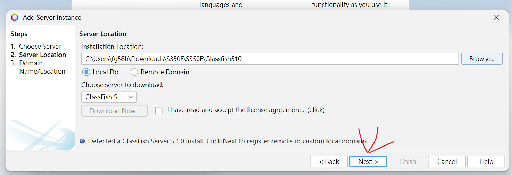
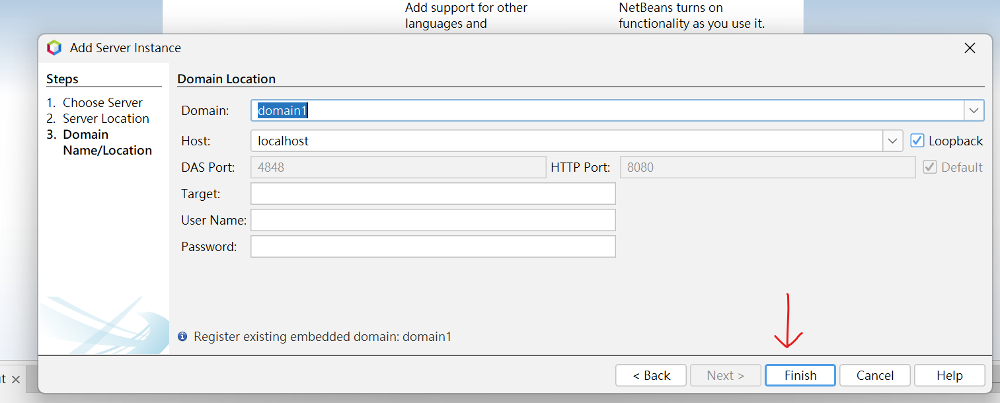
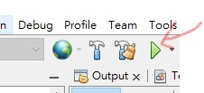

# S350F
studnet AC  ID: s1234511 password:1   
teacher AC  ID: t1234567 password:123456  
it Staff AC  ID: i1234567 password:123456  

需求:
1.  
Need to download Glassfish510 as a server  
https://www.eclipse.org/downloads/download.php?file=/glassfish/glassfish-5.1.0.zip  
Then put it under the project file  

2.  
Need to create a database called s350f in MySql
Then import s350f.sql 
database url should be jdbc:mysql://localhost:3306/s350f  
database User must be root
database Password must be no password  

3.  
Need to download netbeans  
As an IDE to start a project  
 
When you use Netbeans to open a file for the first time, you may encounter server problems. You can follow the image and add it to the server    
  
  
  
  
  
  
  
  
when finished   
  
